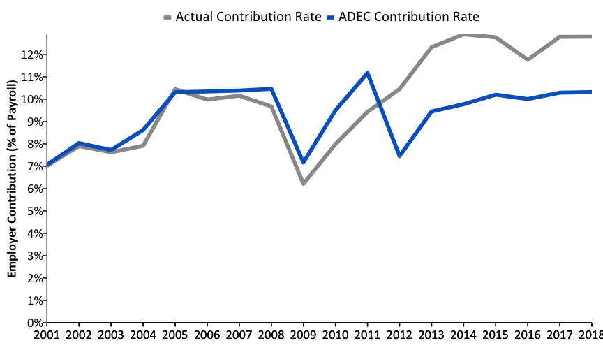
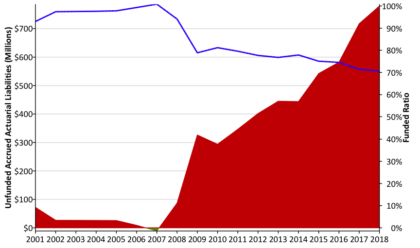

<!-- README.md is generated from README.Rmd. Please edit that file -->

# pensionviewr

The goal of `pensionviewr` is to simplify the process of gathering and
visualizing public pension plan data from the Reason pension database.
This repo contains the functions of the `pensionviewr` package, which
once installed locally, provides helpful functions for creating and
exporting graphics made in ggplot in the style used by the Reason
Pension Integrity Project team.

## Installing pensionviewr

`pensionviewr` is not on CRAN, so you will have to install it directly
from Github using `devtools`.

If you do not have the `devtools` package installed, you will have to
run the first line in the code below as well.

``` r
install.packages('devtools')
devtools::install_github("ReasonFoundation/pensionviewr")
```

## Using the functions:

The package has four functions for data pulling and preparation:
`planList()`, `pullData()`, `loadData`, and `selectedData()`.

The package has four functions for plots: `reasonStyle()`, `glPlot()`,
`linePlot()`, and `debtPlot()`.

A basic explanation and summary here:

### `planList()`

1.  `planList()`: returns a stripped down list of the pension plans in
    the database along with their state and the internal databse id.

Example of how it is used in a standard workflow:

``` r
library(pensionviewr)
pl <- planList()
head(pl)
#>        id                                          display_name   state
#> 1       7        Alabama Clerks & Registrars Supernumerary Fund Alabama
#> 2       8            Jefferson County General Retirement System Alabama
#> 3 3400053            Dothan Employees Pension Retirement System Alabama
#> 4      12             Birmingham Unclassified Employees Pension Alabama
#> 5      21 Tuscaloosa Police & Fire Supplemental Retirement Plan Alabama
#> 6       2             Alabama Teachers' Retirement System (TRS) Alabama
```

### `pullData()`

2.  `pullData()`: pulls the data for a specified plan from the Reason
    pension databse. `pullData` has two arguments: `pullData(pl,
    plan_name)`

<!-- end list -->

  - `pl`: A datafram containing the list of plan names, states, and ids
    in the form produced by the `planList()` function.
  - `plan_name`: A string enclosed in quotation marks containing a plan
    name as it is listed in the Reason pension database.

Example of how it is used in a standard workflow:

The next step would be to load the data for the specific plan of
interest. Let’s use Kansas Public Employees’ Retirement System as an
example. Let’s first see what plans in Kansas are available:

``` r
require(tidyverse)
#> Loading required package: tidyverse
#> ── Attaching packages ───────────────────────────────────── tidyverse 1.2.1 ──
#> ✔ ggplot2 3.1.0     ✔ purrr   0.2.5
#> ✔ tibble  1.4.2     ✔ dplyr   0.7.8
#> ✔ tidyr   0.8.2     ✔ stringr 1.3.1
#> ✔ readr   1.3.0     ✔ forcats 0.3.0
#> ── Conflicts ──────────────────────────────────────── tidyverse_conflicts() ──
#> ✖ dplyr::filter() masks stats::filter()
#> ✖ dplyr::lag()    masks stats::lag()
KS <- pl %>% filter(state == 'Kansas')
head(KS)
#>        id
#> 1     793
#> 2 3396920
#> 3     802
#> 4     804
#> 5     799
#> 6     798
#>                                                            display_name
#> 1                         Kansas Police and Firemen's Retirement System
#> 2       Supplemental Retirement Plan Topeka Uniform School District 501
#> 3                    Kansas City Board of Public Utilities Pension Plan
#> 4 Wichita Supplemental Annuity Business School Partnership Program 3547
#> 5                                    Leavenworth Firemen's Pension Fund
#> 6                                       Leavenworth Police Pension Fund
#>    state
#> 1 Kansas
#> 2 Kansas
#> 3 Kansas
#> 4 Kansas
#> 5 Kansas
#> 6 Kansas
```

The full plan name we are interested in is there listed as “Kansas
Public Employees’ Retirement System”. We can pull the data for it
now:

``` r
kpers_data <- pullData(pl, plan_name = "Kansas Public Employees' Retirement System")
head(kpers_data)
#> # A tibble: 6 x 320
#>   year  id    display_name state data_source_id data_source_name
#>   <chr> <S3:> <chr>        <chr> <S3: integer6> <chr>           
#> 1 2001  790   Kansas Publ… Kans… 2              Pension Plan Da…
#> 2 2002  790   Kansas Publ… Kans… 2              Pension Plan Da…
#> 3 2003  790   Kansas Publ… Kans… 2              Pension Plan Da…
#> 4 2004  790   Kansas Publ… Kans… 2              Pension Plan Da…
#> 5 2005  790   Kansas Publ… Kans… 2              Pension Plan Da…
#> 6 2006  790   Kansas Publ… Kans… 2              Pension Plan Da…
#> # ... with 314 more variables: contributions_other_total <int>,
#> #   deductions_other_total <dbl>, investment_expense_total <dbl>,
#> #   net_increase_decrease_in_fair_value_of_total_investments <dbl>,
#> #   percent_of_assets_invested_in_misc_alternatives <dbl>,
#> #   targeted_percent_of_assets_invested_in_equity_investments_tot <dbl>,
#> #   total_fund_benchmark_return <chr>, x1_yr_investment_return <dbl>,
#> #   x10_year_return_average <dbl>, x10_yr_investment_return <dbl>,
#> #   x12_yr_investment_return <int>, x15_yr_investment_return <int>,
#> #   x2_yr_investment_return <int>, x20_yr_investment_return <int>,
#> #   x25_yr_investment_return <dbl>, x3_year_return_average <dbl>,
#> #   x3_yr_investment_return <dbl>, x30_yr_investment_return <int>,
#> #   x4_yr_investment_return <int>, x5_year_return_average <dbl>,
#> #   x5_yr_investment_return <dbl>, x7_yr_investment_return <int>,
#> #   x8_yr_investment_return <int>,
#> #   actuarial_accrued_liabilities_under_gasb_standards <dbl>,
#> #   actuarial_assets <int>,
#> #   actuarial_assets_reported_for_asset_smoothing <dbl>,
#> #   actuarial_assets_under_gasb_standards <dbl>,
#> #   actuarial_cost_method_code_names <int>,
#> #   actuarial_cost_method_code_names_for_gasb <int>,
#> #   actuarial_cost_method_for_gasb_reporting <chr>,
#> #   actuarial_cost_method_for_plan_reporting <lgl>,
#> #   actuarial_cost_method_notes <lgl>,
#> #   actuarial_funded_ratio_gasb_67 <dbl>,
#> #   actuarial_liabilities_under_entry_age_normal <dbl>,
#> #   actuarial_liabilities_under_projected_unit_credit <int>,
#> #   actuarial_report_calendar_year <int>,
#> #   actuarial_valuation_date_for_actuarial_costs <chr>,
#> #   actuarial_valuation_date_for_gasb_assumptions <int>,
#> #   actuarial_valuation_date_for_gasb_schedules <int>,
#> #   actuarial_valuation_report_date <int>,
#> #   actuarially_determined_contribution <int>,
#> #   actuarially_required_contribution <dbl>,
#> #   administering_government_type <int>,
#> #   administrating_jurisdiction <chr>, aec <int>,
#> #   alternatives_expense <int>, alternatives_income <int>,
#> #   amortizaton_method <chr>, annual_return_on_cash_investments <dbl>,
#> #   annual_return_on_commodity_investments <dbl>,
#> #   annual_return_on_fixed_income_investments <dbl>,
#> #   annual_return_on_hedge_fund_investments <int>,
#> #   annual_return_on_misc_alternative_investments <dbl>,
#> #   annual_return_on_other_investments <int>,
#> #   annual_return_on_private_equity_investments <dbl>,
#> #   annual_return_on_real_estate_investments <dbl>,
#> #   annual_return_on_total_equity_investments <dbl>,
#> #   are_most_members_covered_by_social_security <int>,
#> #   asset_smoothing_baseline <int>,
#> #   asset_smoothing_baseline_add_or_subtract_gain_loss <int>,
#> #   asset_smoothing_period_for_gasb_reporting <int>,
#> #   asset_valuation_method_code_for_gasb_reporting <int>,
#> #   asset_valuation_method_code_for_plan_reporting <int>,
#> #   asset_valuation_method_for_gasb_reporting <chr>,
#> #   asset_valuation_method_for_plan_reporting <lgl>,
#> #   asset_valuation_method_note <lgl>,
#> #   average_age_at_retirement_for_service_retirees <int>,
#> #   average_age_of_actives <dbl>, average_age_of_beneficiaries <dbl>,
#> #   average_age_of_service_retirees <dbl>,
#> #   average_annual_benefit_at_retirement_for_service_retirees <lgl>,
#> #   average_benefit_of_beneficiaries <dbl>,
#> #   average_benefit_paid_to_service_retirees <dbl>,
#> #   average_salary_of_actives <dbl>,
#> #   average_tenure_at_retirement_for_service_retirees <int>,
#> #   average_tenure_of_actives <dbl>, beginning_market_assets_net <dbl>,
#> #   benefits_website <chr>, blended_discount_rate <dbl>,
#> #   cafr_calendar_year <int>, closed_plan <int>, cola_code <lgl>,
#> #   cola_provsion_text <lgl>,
#> #   confict_between_cafr_and_actuarial_valuation <lgl>,
#> #   contributions_employer_total <dbl>,
#> #   contributions_other_employer <int>, contributions_other_member <int>,
#> #   cost_sharing <int>, cost_structure <chr>, covered_payroll <dbl>,
#> #   covered_payroll_gasb_67 <int>, covers_elected_officials <int>,
#> #   covers_local_employees <int>, covers_local_fire_fighters <int>,
#> #   covers_local_general_employees <int>,
#> #   covers_local_police_officers <int>, covers_state_employees <int>,
#> #   covers_state_fire_employees <int>,
#> #   covers_state_general_employees <int>,
#> #   covers_state_police_employees <int>, …
```

### `loadData`

3.  `loadData`: loads the data for a specified plan from an Excel file.
    `loadData` has one argument: `loadData(file_name)`

<!-- end list -->

  - `file_name`: A string enclosed in quotation marks containing a file
    name with path of a pension plan Excel data
    file.

<!-- end list -->

    data_from_file <- loadData('data/NorthCarolina_PensionDatabase_TSERS.xlsx')

### `selectedData()`

4.  `selectedData()`: selects the only the variables used in historical
    analyses. `selectedData` has eight arguments, with the first,
    `wide_data`, being required: `selectedData(wide_data, .date_var =
    "actuarial_valuation_date_for_gasb_assumptions", .aal_var =
    .actuarial_accrued_liabilities_under_gasb_standards", .asset_var =
    "actuarial_assets_under_gasb_standards", .adec_var =
    "employer_annual_required_contribution", .er_cont_var =
    "employer_contributions", .ee_cont_var = "employee_contributions",
    .payroll_var = "covered_payroll")`

<!-- end list -->

  - `wide_data`: a datasource in wide format
  - `.date_var` column name for valuation date. Default: ‘Actuarial
    Valuation Date For GASB Assumptions’
  - `.aal_var` column name AAL. Default: ‘Actuarial Accrued Liabilities
    Under GASB Standards’
  - `.asset_var` column name for Actuarial Assets. Default: ‘Actuarial
    Assets under GASB standards’
  - `.adec_var` column name for ADEC. Default: ‘Employer Annual Required
    Contribution’
  - `.er_cont_var` column name for employer contributions. Default:
    ‘Employer Contributions’
  - `.ee_cont_var` column name for employee contributions. Default:
    ‘Employee Contributions’
  - `.payroll_var` column name for payroll. Default: ‘Covered Payroll’

Back to the Kansas Public Employees’ example. That is a lot of
variables. The `selectedData()` function selects only a handful of
needed variables:

``` r
df <- selectedData(kpers_data)
head(df)
#> # A tibble: 6 x 12
#>    year valuation_date actuarial_assets    aal   adec er_cont ee_cont
#>   <dbl> <date>                    <dbl>  <dbl>  <dbl>   <dbl>   <dbl>
#> 1  2000 2000-12-31              9835182 1.11e7 2.49e5 193384. 204143.
#> 2  2001 2001-12-31              9962918 1.17e7 2.60e5 221474. 209624.
#> 3  2002 2002-12-31              9784862 1.26e7 2.82e5 231464. 224746.
#> 4  2003 2003-12-31             10853462 1.44e7 3.39e5 714353. 230350.
#> 5  2004 2004-12-31             10971427 1.57e7 3.82e5 293952. 233226.
#> 6  2005 2005-12-31             11339293 1.65e7 4.71e5 352032. 246203.
#> # ... with 5 more variables: payroll <dbl>, uaal <dbl>,
#> #   funded_ratio <dbl>, adec_contribution_rates <dbl>,
#> #   actual_contribution_rates <dbl>
```

### `reasonStyle()`

5.  `reasonStyle()`: has no arguments and is added to the ggplot chain
    after you have created a plot. What it does is generally makes text
    size, font and colour, axis lines, axis text and many other standard
    chart components into Reason style.

The function is pretty basic and does not change or adapt based on the
type of chart you are making, so in some cases you will need to make
additional `theme` arguments in your ggplot chain if you want to make
any additions or changes to the style, for example to add or remove
gridlines etc. Also note that colours for lines in the case of a line
chart or bars for a bar chart, do not come out of the box from the
`reasonStyle` function, but need to be explicitly set in your other
standard `ggplot` chart functions.

Example of how it is used in a standard workflow:

    line <- ggplot2(line_df, aes(x = year, y = lifeExp)) +
    geom_line(colour = "#007f7f", size = 1) +
    geom_hline(yintercept = 0, size = 1, colour="#333333") +
    reasonStyle()

### `glPlot()`

6.  `glPlot()`: creates the ‘Gain/Loss’ plot using a CSV file as an
    input. glPlot has two arguments: \`glPlot(filename, ylab\_unit)

<!-- end list -->

  - `filename`: a csv (comma separated value) file containing columns of
    gain loss category names with one row of values.
  - `ylab_unit`: a string contained within quotation marks containing th
    y-axis label unit. The default value is “Billions”

Example of how it is used in a standard workflow:

    filename <- "data/GainLoss_data.csv"
    glPlot(filename)

### `linePlot()`

7.  `linePlot()`: creates a plot comparing two variables, such as ADEC
    vs. Actual contributions. `linePlot()` has six arguments, with
    `data` being required:

`linePlot(data, .var1, .var2, labelY, label1, label2)`

  - `data` a dataframe produced by the selectedData function or in the
    same format.
  - `.var1` The name of the first variable to plat, default is
    adec\_contribution\_rates.
  - `.var2` The name of the second variable to plot, default if
    actual\_contribution\_rates.
  - `labelY` A label for the Y-axis.
  - `label1` A label for the first variable.
  - `label2` A label for the second variable.

<!-- end list -->

``` r
linePlot(df)
```



### `debtPlot()`

8.  `debtPlot()`: creates the “History of Volatile Solvency” or
    “Mountain of Debt” chart. `debtPlot` takes one argument:

`debtPlot(data)`

  - `data`: a dataframe produced by the `selectedData()` function or in
    the same format containing year, uaal, funded ratio columns.


